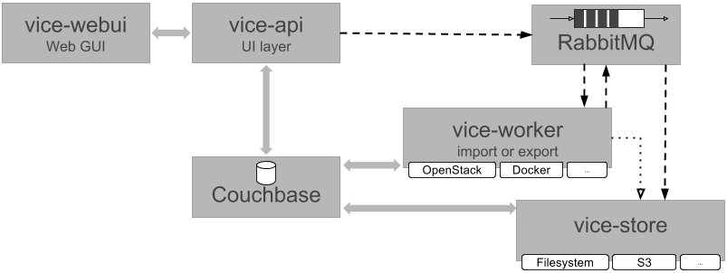

# ViCE-Registry: an Image Registry for Virtual Images

* The ViCE registry is a central image registry
* The ViCE registry bridges the gaps between 
  * organizations
  * execution environments and 
  * communities.

ViCE registry supports declarative images (e.g. Packerfiles, Dockerfiles)
and implicit images (e.g. virtual machine disk snapshots, docker images).

The current version supports OpenStack Glance and bwLehrpool as execution
environments.

Build State for each component:
 * ViCE API 
 * ViCE Worker  
 * ViCE Store 
 * ViCE WebUI 

## How to set up ViCE Registry

The most recent versions of ViCE registry builds automatically and is shipped
through [Docker Hub](https://hub.docker.com/u/viceregistry/).

To set up the ViCE registry, the `docker-compose.yml` file in this repository can be
used to start all the necessary containers via a simple `docker-compose up`.

## Internals: ViCE Registry Architecture

The ViCE registry consists of several layers:

These layers are implemented by components, which are micro services communicating
over RabbitMQ as message queue:

