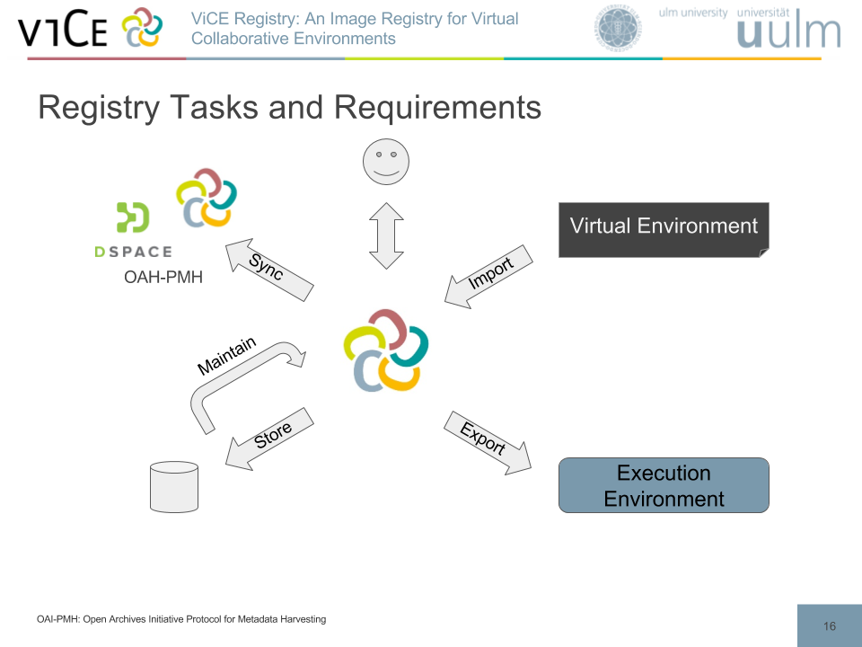

# ViCE-Registry Documentation

## Structure

This documentation consists of several sections:

1. [Motivation & Use Cases](./motivation.md)
2. [Installation  Guide](./installation.md)
3. [Usage Guide](./usage.md)
4. [Development Guide](./development.md)

## Overview

The ViCE Registry allows to import virtual environments, which can then later be
exported to execution environments. The ViCE Registry needs to store imported
images, and provides a maintenance cycle e.g. for updating or converting virtual
environments. The synchronization between virtual registries and allows to
export virtual environments to institutional repositories.

## Further Reading

The concept of the ViCE-Registry is published at the **9th IEEE International
Conference on Cloud Computing Technology and Science (CloudCom 2017)** in Hong
Kong on 11-14 December 2017 under the title "ViCE Registry: An Image Registry
for Virtual Collaborative Environments". Proceedings not available at present
(20.12.2017). The presentation slides are [available here](CloudCom-2017_ViCE-Registry.pdf).
