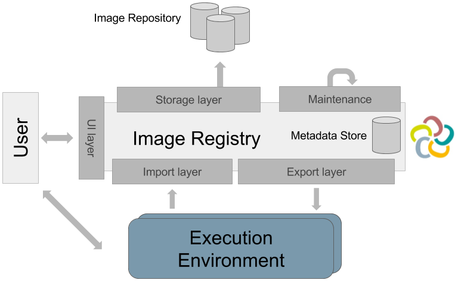
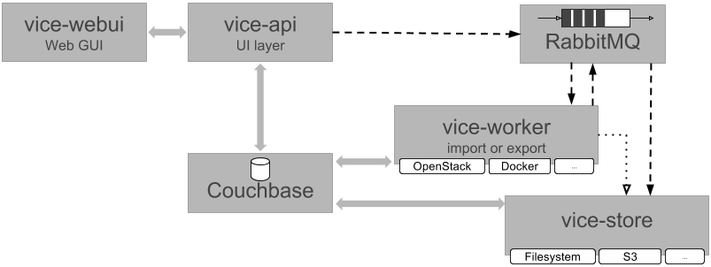

# ViCE-Registry Documentation

## Structure

This documentation consists of several sections:

1. [Motivation & Use Cases](./motivation.md)
2. [Installation  Guide](./installation.md)
3. [Usage Guide](./usage.md)
4. [Development Guide](./development.md)

## Development Guide

The ViCE-Registry components can be found in their own Github repositories:

Build State for each component:
 * [ViCE API](https://github.com/vice-registry/vice-api) 
 * [ViCE Worker](https://github.com/vice-registry/vice-worker)  
 * [ViCE Store](https://github.com/vice-registry/vice-store) 
 * [ViCE WebUI](https://github.com/vice-registry/vice-webui) 

## Architecture

The basic architecture of the ViCE-Registry looks as follows:

These layers are implemented by components, which are micro services communicating
over RabbitMQ as message queue:

