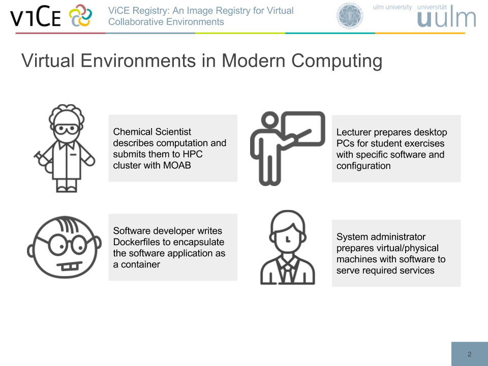
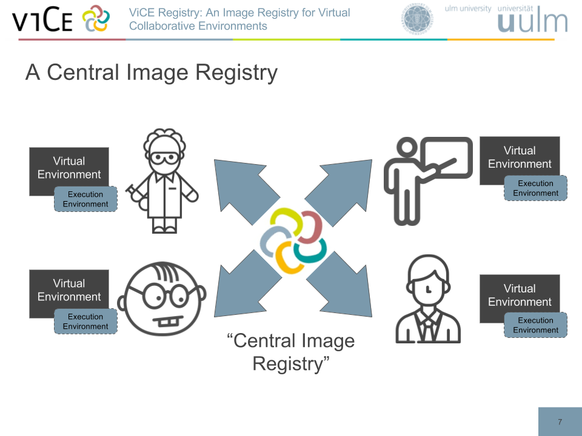

# ViCE-Registry Documentation

## Structure

This documentation consists of several sections:

1. [Motivation & Use Cases](./motivation.md)
2. [Installation  Guide](./installation.md)
3. [Usage Guide](./usage.md)
4. [Development Guide](./development.md)

## Motivation

Virtual Environments can be found in any area of modern computing. One example:
a chemical scientist describes a computation for running in an HPC cluster. This
computation, as a declarative description of a virtual environment, depends on
the application, and the execution environment the scientist has at hand. This
virtual environment is dedicated to run on this single execution environment.

The ViCE Registry is hence a central hub to store virtual environments, with
enough information about the initially used execution environment. With this
knowledge about the virtual environment and the execution environment, the ViCE
registry allows a *cross organizational*, *cross execution environmental* and *cross communities* deployments to solve the existing gaps.

## Use Case Examples

1. The first use case is an HPC computation, which is designed to run in one
   specific execution environment. With the ViCE Registry, this computation can
   be stored and archived. At any point in the future, this computation can be
   recreated - even on different execution environment. The original cluster may
   not be available any more, but can be e.g. emulated on a Cloud infrastructure.
2. The second use case is an lecturer, who prepares virtual desktops for
   students with bwLehrpool on a local pool of desktop computers. Since students
   may want to follow the exercises from home, the lecturer imports the virtual
   desktop as a virtual environment in the ViCE registry and allows a later
   export into a private or public Cloud. Students can easily deploy the most
   recent version on e.g. bwCloud and access the virtual desktop via VNC or
   Windows Remote Desktop.
